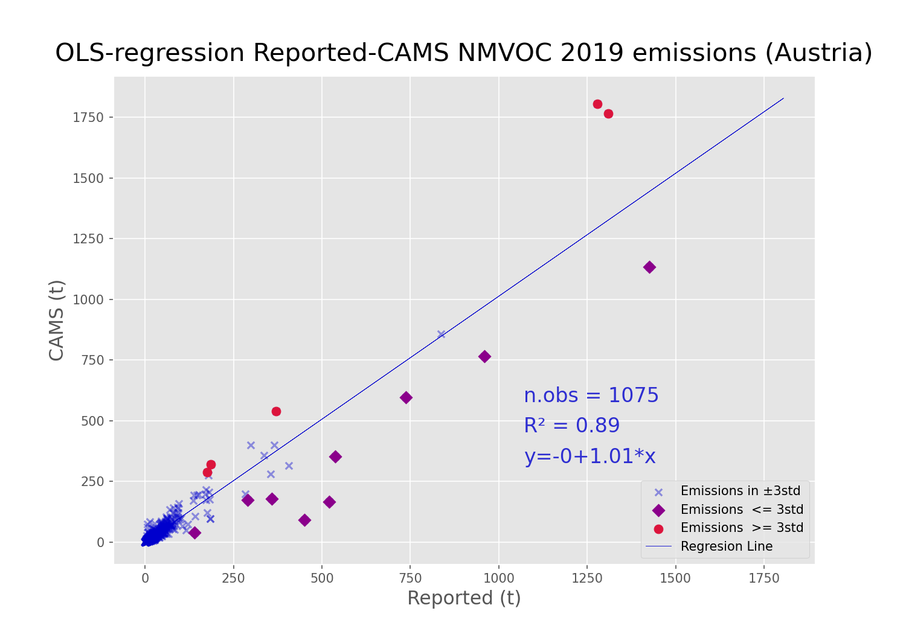

# CLRTAP Gridded Review 2024

This repository contains the code and setup instructions in the [jupyter](./jupyter/) folder for the gridded emissions review in 2024, focusing on GNFR E_Solvents and NMVOC. The outputs of the review include Ordinary Least Squares (OLS) regression plots comparing reported data against CAMS data. See an example below.

